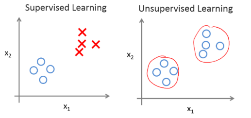

# Chapter 1: `Introduction`

## Machine Learning definition

如果P可以用来评估程序在某任务T的性能，若一个程序通过利用经验E在任务T上使P获得了提升，则我们就说关于P和T，该程序对经验E进行了学习。常用英文定义为：A computer program is said to learn from experience E with respect to some class of tasks T and performance measure P, if its performance at tasks in T, as measured by P, improves with experience E. 也就是用数据和以往的经验，产生模型，优化任务性能。

## Application examples
* Database mining: Web click data（点击流数据）,medical records, biology,engineering
* Applications can't program by hand:NLP,handwriting recognition, ...
* self-customizing programs（用户自定制程序）

## Basic terms
* 样本（示例）：指单个示例或者整个样本集
* 特征（属性）：反应事件或者对象在某方面的特性
* 样本空间（输入空间）：属性张开的空间
* 特征向量：在样本空间内每一个点代表一个坐标向量，我们亦可把一个样本称为一个“特征向量”
* 假设：学得模型对应关于数据的某种潜在规律
* 学习器：指模型，亦可看做学习算法在给定数据和参数上的实例化
* 标签（标记）：拥有标记信息的样本，张开的空间对应为标记空间
* 分类与回归：监督学习的代表，若预测为离散值则为分类，如0,1,2等，若预测为连续值则为回归。
* 聚类：无监督学习的代表，把一组数据分成若干簇，以了解数据的潜在规律
* 泛化：学的模型适用于新样本的能力
* 独立同分布iid：假设样本空间的全体样本服从分布“D”，我们获得的样本都是独立的从这个分布中采样获得
* 归纳与演绎：前者是从特殊到一般的泛化过程，从具体的事实里总结出一般性规律；后者是从基本原理推演出具体状况，我们学得模型（训练）是归纳学习的的过程，其定义如下：
	1. 广义上：从样本中学习
	2. 狭义上：要求从训练样本中学得概念，亦称概念学习
* 偏好（归纳偏好）：机器学习算法在学习的过程中对某种类型假设的偏好
* 剃刀原理（奥卡姆剃刀原理）：若有对多个假设和观察一致，我们则选择最简单的那个，即“如无必要，勿增实体”。
* 没有免费的午餐定理 NFL: 不考虑具体问题的情况下，没有任何一个算法比另一个算法更优，甚至没有胡乱猜测更好。

## Machine Learning algorithms
* Supervised learning（监督学习）
	* Regression（回归问题）：如[房价预测](../Image-Gallery/1-1房价预测示意图.PNG "房价预测")等	
	* Classfication（分类问题）：如[区分恶性或良性肿瘤](../Image-Gallery/1-2肿瘤预测示意图.PNG "肿瘤预测") 
* Unsupervised learning（无监督学习）
	* 无监督学习是指没有任何标签或者有相同的标签，也就是到我们手里的只是一个数据集，别的均不知，主要为“聚类”。下图可以看出两者之间的差异：
 
	* 同时，若有有顾客数据集，自动地发现“市场分类”，并自动地把顾客划分到不同的细分市场中，自动并更有效地销售或不同的细分市场一起进行销售

## Development history

