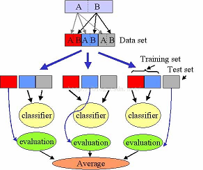

# Chapter 1: `Introduction`

## Machine Learning definition

如果P可以用来评估程序在某任务T的性能，若一个程序通过利用经验E在任务T上使P获得了提升，则我们就说关于P和T，该程序对经验E进行了学习。常用英文定义为：A computer program is said to learn from experience E with respect to some class of tasks T and performance measure P, if its performance at tasks in T, as measured by P, improves with experience E. 也就是用数据和以往的经验，产生模型，优化任务性能。

## Application examples
* Database mining: Web click data（点击流数据）,medical records, biology,engineering
* Applications can't program by hand:NLP,handwriting recognition, ...
* self-customizing programs（用户自定制程序）

## Basic terms
* 样本（示例）：指单个示例或者整个样本集
* 特征（属性）：反应事件或者对象在某方面的特性
* 样本空间（输入空间）：属性张开的空间
* 特征向量：在样本空间内每一个点代表一个坐标向量，我们亦可把一个样本称为一个“特征向量”
* 假设：学得模型对应关于数据的某种潜在规律
* 学习器：指模型，亦可看做学习算法在给定数据和参数上的实例化
* 标签（标记）：拥有标记信息的样本，张开的空间对应为标记空间
* 分类与回归：监督学习的代表，若预测为离散值则为分类，如0,1,2等，若预测为连续值则为回归。
* 聚类：无监督学习的代表，把一组数据分成若干簇，以了解数据的潜在规律
* 泛化：学的模型适用于新样本的能力
* 独立同分布iid：假设样本空间的全体样本服从分布“D”，我们获得的样本都是独立的从这个分布中采样获得
* 归纳与演绎：前者是从特殊到一般的泛化过程，从具体的事实里总结出一般性规律；后者是从基本原理推演出具体状况，我们学得模型（训练）是归纳学习的的过程，其定义如下：
	1. 广义上：从样本中学习
	2. 狭义上：要求从训练样本中学得概念，亦称概念学习
* 偏好（归纳偏好）：机器学习算法在学习的过程中对某种类型假设的偏好
* 剃刀原理（奥卡姆剃刀原理）：若有对多个假设和观察一致，我们则选择最简单的那个，即“如无必要，勿增实体”。
* 没有免费的午餐定理 NFL: 不考虑具体问题的情况下，没有任何一个算法比另一个算法更优，甚至没有胡乱猜测更好。

## Machine Learning algorithms
* Supervised learning（监督学习）
	* Regression（回归问题）：如[房价预测](../Image-Gallery/1-1房价预测示意图.PNG "房价预测")等
	* Classfication（分类问题）：如[区分恶性或良性肿瘤](../Image-Gallery/1-2肿瘤预测示意图.PNG "肿瘤预测") 
* Unsupervised learning（无监督学习）
	* 无监督学习是指没有任何标签或者有相同的标签，也就是到我们手里的只是一个数据集，别的均不知，主要为“聚类”。如图可以看出[监督和非监督学习的区别](../Image-Gallery/1-3监督和非监督学习的区别.PNG "差异")  
	* 同时，若有有顾客数据集，自动地发现“市场分类”，并自动地把顾客划分到不同的细分市场中，自动并更有效地销售或不同的细分市场一起进行销售

## 发展历程
1. 1950s-1970s初：“推理期”，其代表为A. Newell和H. Simon的[“逻辑理论家”程序](https://baike.baidu.com/item/%E9%80%BB%E8%BE%91%E7%90%86%E8%AE%BA%E5%AE%B6/22387669?fr=aladdin#ref_[1]_23003630)
2. 1950s中后期：基于神经网络的“连接主义”学习(connectionism)开始出现，其代表有F.Rosenblatt的[感知机(Perceptron)](https://baike.baidu.com/item/%E6%84%9F%E7%9F%A5%E5%99%A8/16525448#1)
3. 1960s-1970s：基于逻辑表示的“符号主义”发展，其代表性工作“结构学习系统”、“基于逻辑的归纳学习系统”、“概念学习系统”等
4. 1970s中期后：“知识期”，大量专家系统问世
5. 1980s：把机器学习分为：“从样本中学习”、“在问题求解和规划中学习”、“通过观察和发现学习”“从指令中学习”
6. 1980s-1990s：“从样本中学习”的一大主流是符号主义学习，其代表包括决策树`(decision tree)`和基于逻辑的学习，后者的著名代表是归纳逻辑程序设计ILP,但由于表达能力太强，直接导致学习过程中假设空间太大，复杂度极高陷入低潮
7. 1990s中期前：“从样本中学习”的一大主流是基于神经网络的“连接主义”学习，其代表为`BP算法`，但产生的是“黑箱”模型，最大的局限在于“试错性”，也就是调参难。
8. 1990s中期：“统计学习”进入主流，其代表为支持向量机`(SVM)`和更一般的“核方法”
9. 20世纪初，“连接主义”学习以深度学习之名卷土重来

## 模型评估与选择
### 经验误差与过拟合
* 经验误差：亦称训练误差，指学习器在训练集上的误差，在新样本上的误差称为“泛化误差”，错误率为a/m，相应的精度为1-a/m，m和样本，a个样本出现错误
* 过拟合：当学习器把训练样本学的“太好”的时候，很可能把训练样本自身一些特点当做了潜在的规律，这样会导致模型的泛化能力下降，这种现象称为“过拟合”，一般是学习能力过于强大导致的，与之相对应的是“欠拟合”
	* 过拟合为什么无法避免，只能缓解？
	* 答：机器学习面临的问题一般是[NP难](../Chapter-1-Introduction/NP-Hard.md)甚至更难，而有效的学习算法是在多项式时间内完成的，若可避免过拟合，则通过最小化经验误差就可以获得最优解，这就意味着我们构造性的证明了P=NP，但只要相信P!=NP,过拟合就无法避免.
### 评估方法
* 留出法：直接将数据集划分成两个互斥的数据集S和T，S用于训练得出模型，T用于测试，对泛化误差进行估计，代码如下[matlab](../Chapter-1-Introduction/matlab_codes/hold_out.m)和[python](../Chapter-1-Introduction/python_codes/hold_out.py).（一般2/3-4/5用于训练，其余用于测试）
* 交叉验证法：先把数据集分成k个大小相似的互斥子集，在通过分层抽样以保证数据分布一致，然后用k-1个子集的并集作为训练集，余下的子集作为测试集，这样可以获得k组训练/测试集合，进行k次训练和测试，返回k个结果的均值。
	* matlab函数是：[indices = crossvalind('Kfold',data,k)](../Chapter-1-Introduction/matlab_codes/cross_validation.m);k若为1则是留一法（LOO）
	* 在pyhon中实现交叉验证法，需要用到sklearn.model_selection模块里的一些函数，具体详见[cross_validation.md](../Chapter-1-Introduction/python_codes/cross_validation.md)文档，代码实现详见[cross_validation.py](../Chapter-1-Introduction/python_codes/cross_validation.py).

